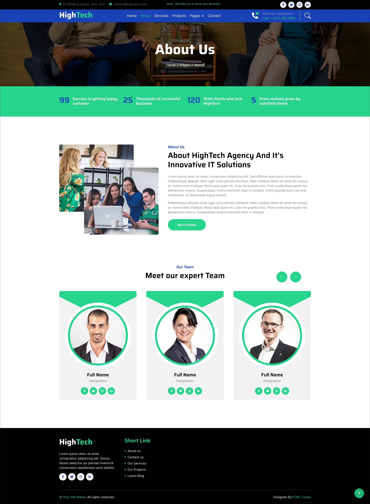
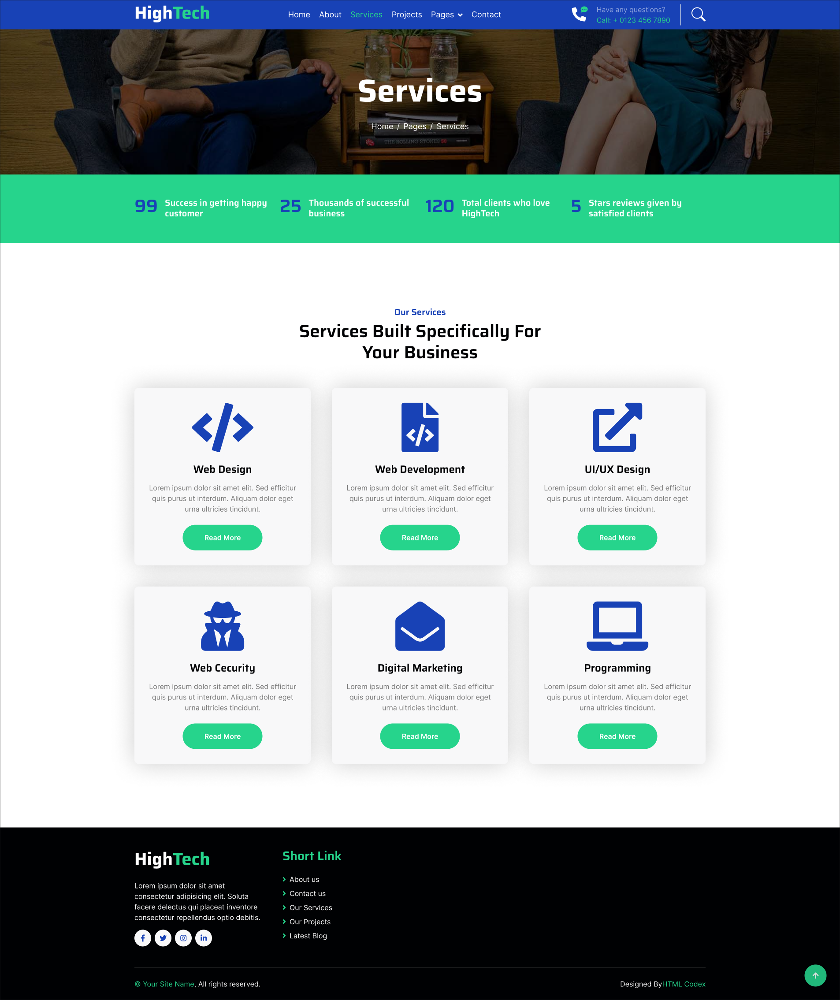
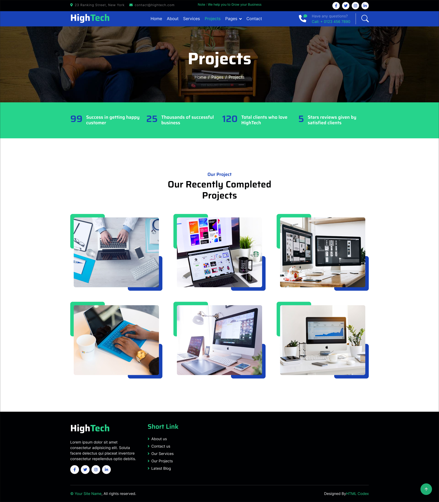
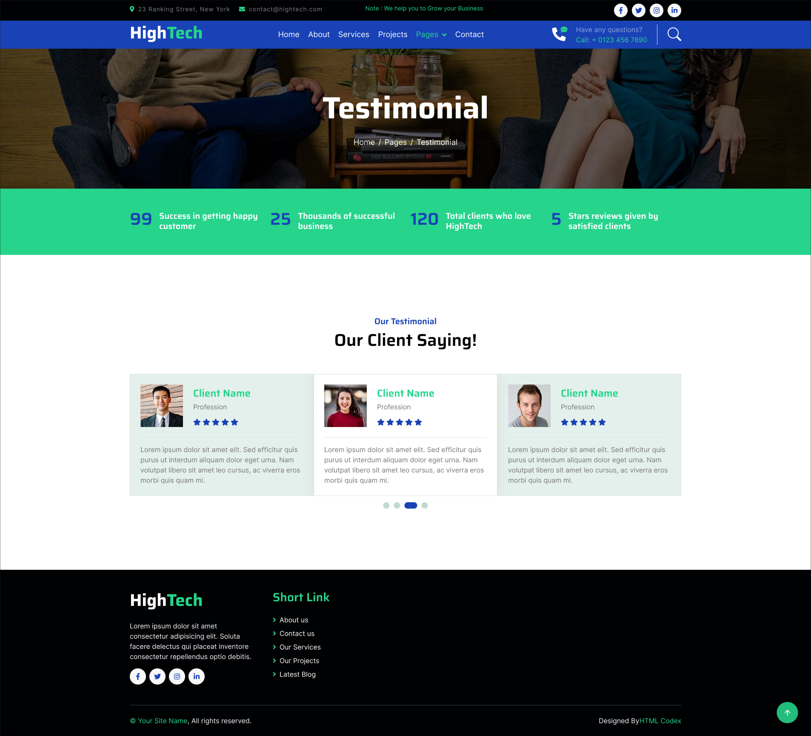
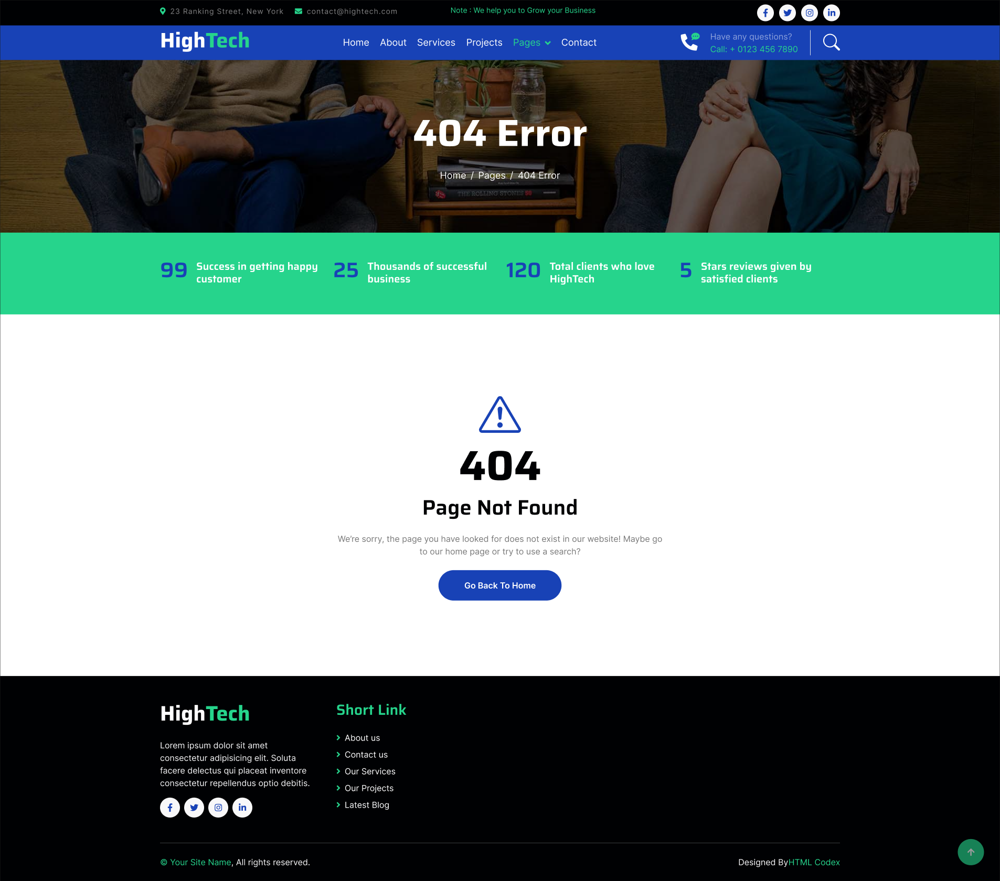
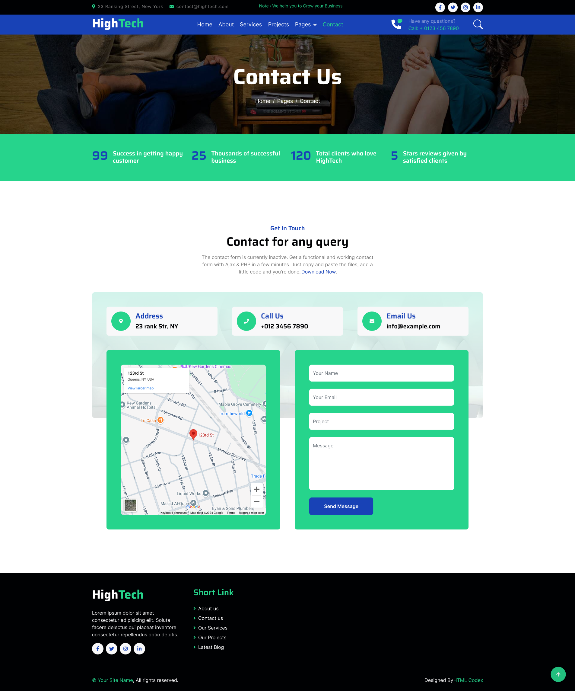

# IT Solutions Laravel Application

<p align="center">
<a href="https://github.com/laravel/framework/actions"></a>
<a href="https://packagist.org/packages/laravel/framework"></a>
<a href="https://packagist.org/packages/laravel/framework"></a>
</p>

## About the Project

HighTech is a creatively designed and modern Laravel-based landing page for IT solution companies and digital agencies. This project has been built to meet the needs of startups, IT service providers, SEO agencies, graphic design firms, and all types of internet marketing agencies. Whether you're creating a site for a digital agency, web development firm, or SEO services provider, this project will help you get up and running quickly.

Built with Laravel, this project is based on the [HTML Codex IT Solutions template](https://htmlcodex.com/demo/?item=2737) and leverages the power of Bootstrap v5 to ensure responsiveness and adaptability across all devices, including desktops, tablets, and mobile phones. The template is highly customizable, making it easy to create a stunning website without requiring any advanced coding skills.

### Key Features

- **9 Pre-Built Pages**: Includes essential pages like Home, About, Services, Projects, Blog, Team, Testimonials, 404 Error, and Contact.
- **Responsive Design**: Fully responsive layout that works across all devices.
- **Interactive Elements**: Includes animations, carousels, and hover effects to enhance the user experience.
- **Dynamic Navigation**: Active navigation links are automatically highlighted based on the current route.
- **Built with Laravel**: Leveraging the Laravel framework for scalability, security, and ease of development.
- **Customizable Layout**: Easily modifiable components, making it easy to adapt the template to your business needs.
- **Bootstrap v5 and Sass Support**: Built with Bootstrap 5 and Sass for a modern and responsive design.

### Built for Multiple Industries

This project is perfect for:

- IT Solution companies
- Digital agencies
- SEO services
- Web development firms
- Creative agencies
- Consulting & financial firms
- Content marketing agencies
- Online marketing companies

### Template Features

- Clean, valid HTML5 and CSS3 code
- Built using the Bootstrap v5 framework
- Sass supported for easy custom styling
- Integrated Google Web Fonts and Font Awesome icons
- Well-commented and developer-friendly codebase
- Cross-browser compatibility (Chrome, Firefox, Safari, Edge)
- Mobile-friendly and responsive design
- Sticky navigation bar with a dropdown
- Interactive header carousel
- Smooth page scrolling and hover effects
- Team and Testimonial carousels
- "Back to Top" button
- Google Map integration for contact page
- Fully working contact form

## Installation

1. Clone the repository:

    ```bash
    git clone https://github.com/itsharppro/it_solutions_laravel.git
    ```

2. Navigate to the project directory:

    ```bash
    cd it_solutions_laravel
    ```

3. Install the dependencies using Composer:

    ```bash
    composer install
    ```

4. Copy the `.env.example` file to `.env`:

    ```bash
    cp .env.example .env
    ```

5. Generate the application key:

    ```bash
    php artisan key:generate
    ```

6. Run the database migrations:

    ```bash
    php artisan migrate
    ```

7. Start the local development server:

    ```bash
    php artisan serve
    ```

## Preview of Pages

Here are some previews of the main pages of the application:

### Home Page


### About Page


### Services Page



### Projects Page



### Blog Page



### Team Page



### Testimonials Page



### Contact Page



## Deployment

For deployment, ensure that you configure your `.env` file with the correct settings for your database, caching, and mail services.

## License

This project is covered by two licenses:

- The HTML template used in this project is licensed under the [HTML Codex License](Licence.md).
  
- The Laravel code and any other custom modifications are open-source and licensed under the [MIT license](https://opensource.org/licenses/MIT).

